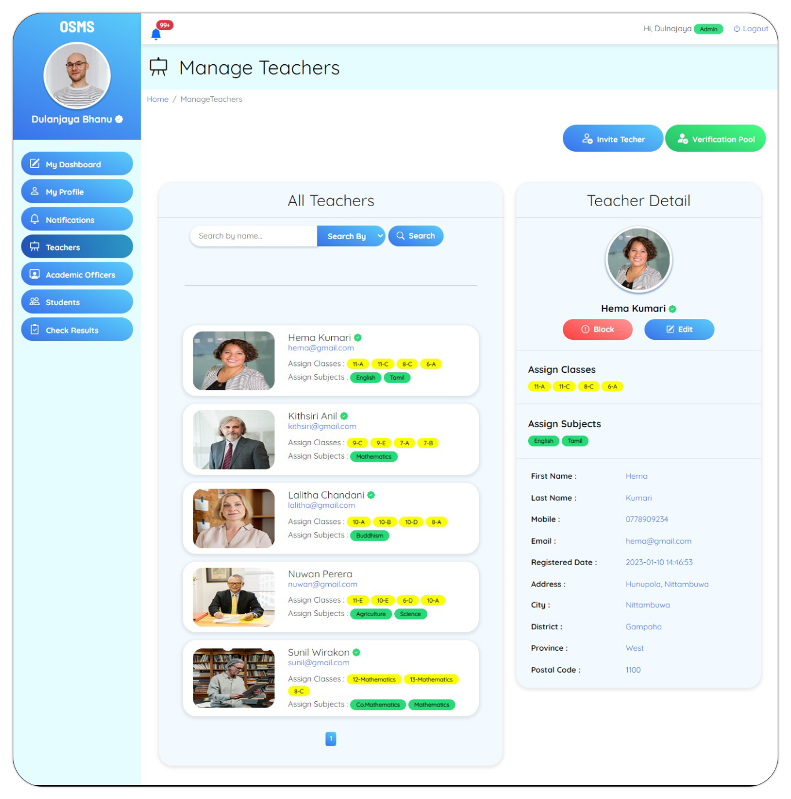
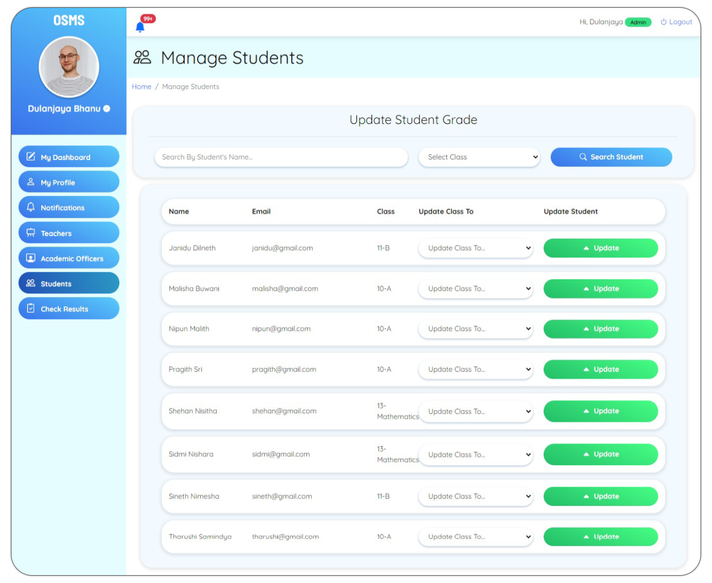

<br/>
<div align="center">
<a href="https://github.com/dulanjayabhanu/OSMS">

</a>
<h3 align="center">OSMS</h3>
<p align="center">
FULLY FUNCTIONAL ONLINE STUDENT MANAGEMENT SYSTEM
<br/>
<br/>
<a href="https://github.com/dulanjayabhanu/OSMS"><strong>Explore the docs »</strong></a>
<br/>
<br/>
<a href="https://github.com/dulanjayabhanu/OSMS/">View Repo .</a>  
<a href="https://github.com/dulanjayabhanu/OSMS/issues/new?labels=bug&amp;template=bug_report.md">Report Bug .</a>
<a href="https://github.com/dulanjayabhanu/OSMS/issues/new?labels=enhancement&amp;&template=feature_request.md">Request Feature</a>
</p>
</div>

  

## 📚 OSMS - Online Student Management System

Welcome to OSMS! This is an all-inclusive student management system designed to facilitate remote education management during the pandemic. Developed using PHP, CSS, Bootstrap, JS, jQuery, and AJAX, OSMS aims to provide an easy-to-use and user-friendly interface for admins, teachers, students, and academic officers.

<div>
  
</div>

## 🚀 Features

### Admin
- 🔐 Login
- ⚙️ Manage Administration
- ✉️ Send invitations to teachers and academic officers for registration
- 🧑‍🏫 Manage Teachers
- 🧑‍🎓 Manage Academic Officers
- 👨‍🎓 Manage Students
- 📈 Check results
- ✏️ Update profile
- 🚪 Log out

### Teacher
- 🔐 Log in
- 📝 Add lesson notes
- 📝 Add new assignments
- 📄 View submitted answer sheets
- 🏆 Add assignment marks
- ✏️ Update profile
- 🚪 Log out

### Student
- 🔐 Log in
- 📥 Download assignments
- 📚 View lesson notes
- 📤 Upload answers
- ✏️ Update profile
- 🚪 Log out

### Academic Officer
- 🔐 Log in
- 📝 Register students and send verification codes
- 🏆 View assignment marks released by teachers
- 🎓 Release marks to students
- ✏️ Update profile
- 🚪 Log out

## 🛠️ Technical Details

### Technology Stack
- **Backend:** PHP
- **Frontend:** HTML, CSS, Bootstrap, JavaScript, AJAX, JSON
- **Database:** MySQL

### Installation
1. Clone the repository:
   ```bash
   git clone https://github.com/your-username/OSMS.git
2. Navigate to the project directory:
   ```bash
   cd OSMS
3. Configure your database settings in the config.php file.
4. Import the osms.sql file into your MySQL database.
5. Start your local server (e.g., using XAMPP or WAMP).

### Usage
1. Open your web browser and navigate to `http://localhost/OSMS`.
2. Log in as an admin, teacher, student, or academic officer using the respective credentials.

## 📜 Documentation

### Registration Process
- **Admin:** Manages the entire system and sends out invitations.
- **Teacher:** Receives an email with a username, password, and unique verification code from the admin.
- **Student:** Receives a verification code from the academic officer to verify their account.
- **Academic Officer:** Similar to the teacher's registration process but manages student registration and marks release.

### Important Notes
- Teachers submit assignment marks to academic officers before they are released to students.
- Students have free access for one month and must pay for continued access after the trial period.
- The admin is the only user who can update a student's grade.

## 📝 License
This project is licensed under the Apache License.

## 🙌 Contributing
We welcome contributions! Please fork the repository and create a pull request with your changes.

<div>
  
</div>

## 📬 Contact
If you have any questions or feedback, please contact us at dulanjaywebs@gmail.com.
